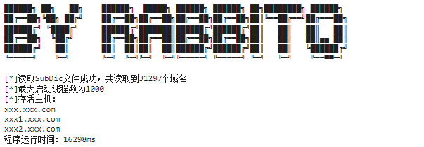

# SubDomainBrute
Java子域名爆破工具
### 描述
现经过优化后，预计31297个域名调整好参数后大概在16秒左右能够跑完，效果大概如下图：


### Usage：
将PortService放到Jar包所在目录下，后执行java -jar JarName，参数项：

```
Usage: <main class> [options]
  Options:
  * --domain, -d
      目标域名
    help, --help
      查看帮助信息
    --nameserver, -n
      超时时间
    --threads, -t
      线程数
      Default: 100
```